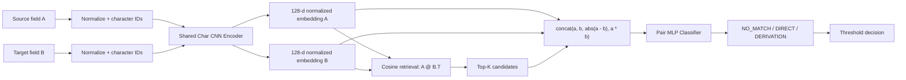

# Metadata Field Matcher MVP

一个完全本地运行、面向企业内部元数据字段映射的 CPU-only 机器学习基线。它用共享权重的字符级 CNN 学习字段名表示，先做余弦相似度检索，再对候选字段进行 `NO_MATCH`、`DIRECT`、`DERIVATION` 三分类。项目不调用云 API、不下载预训练模型，也不向互联网发送字段或训练数据。

## Quick Start

以下 6 步可用仓库自带的小型示例数据跑通完整流程。示例数据只用于功能验证，不能代表真实模型效果。Linux/macOS 命令如下；训练结束后，将后续命令中的 `artifacts/run_YYYYMMDD_HHMMSS` 替换为日志中打印的实际运行目录。

```bash
python -m venv .venv && source .venv/bin/activate && python -m pip install -r requirements.txt
python scripts/validate_data.py --train data/examples/train.csv --validation data/examples/validation.csv --test data/examples/test.csv --strict-leakage-check
python scripts/train_model.py --config config.example.json --train data/examples/train.csv --validation data/examples/validation.csv --test data/examples/test.csv --artifacts-dir artifacts
python scripts/evaluate_model.py --model-dir artifacts/run_YYYYMMDD_HHMMSS --test data/examples/test.csv --output artifacts/run_YYYYMMDD_HHMMSS/evaluation.json
python scripts/predict_pairs.py --model-dir artifacts/run_YYYYMMDD_HHMMSS --a "sale_price" --b "SalePrice"
python scripts/match_groups.py --model-dir artifacts/run_YYYYMMDD_HHMMSS --source data/examples/source_fields.csv --target data/examples/target_fields.csv --top-k 10 --threshold 0.80 --output predictions.csv
```

Windows PowerShell 的环境创建与激活方式见 [Installation](#installation)。

## What It Does

系统接收两组 metadata field：Source fields（A group）和 Target fields（B group）。它为每个 A 字段寻找最可能对应的 B 字段，并判断关系类型：

- `NO_MATCH`：两个字段无可信映射关系；
- `DIRECT`：字段含义直接对应，例如 `sale_price -> SalePrice`；
- `DERIVATION`：目标值需要由源值派生或转换，例如 `trade_date -> settlement_date`。

训练数据来自已经人工确认的字段对，格式为 `A,B,label`。真实生产场景中，系统先从 B group 检索 Top-K 候选，再用 pair classifier 重排，并依据置信阈值自动接受、送人工复核或判为不匹配。

## Architecture



默认 `FieldEncoder` 结构：

1. 字符 embedding：32 维，`PAD` 使用 `padding_idx`；
2. 四路 `Conv1d + ReLU + Global Max Pooling`，kernel size 为 2、3、4、5，每路 64 channels；
3. 拼接为 256 维，经线性层投影到 128 维；
4. 使用 L2 normalization，因而点积可直接作为 cosine similarity。

A 与 B 始终经过同一个 `FieldEncoder` 实例，权重完全共享，而不是两个独立 encoder。训练分两阶段：

- Phase 1：将 `DIRECT` 和 `DERIVATION` 视为 match positive，将 `NO_MATCH` 视为 negative，以 `CosineEmbeddingLoss` 训练 encoder；
- Phase 2：从最佳 Phase 1 encoder 开始，默认冻结 encoder，只训练 pair classifier。可通过 `fine_tune_encoder` 打开联合微调。

分类器输入为 `a`、`b`、`abs(a-b)`、`a*b` 的拼接。默认 embedding 为 128 维，所以输入正好是 512 维，MLP 为 `512 -> 256 -> 64 -> 3`，并使用 `CrossEntropyLoss`。

## Why Char CNN Instead of Transformer

本 MVP 暂不使用 Transformer。元数据字段名通常很短，例如 `sale_price`、`SalePrice`、`sale-pri`、`settle_dt`、`customer_no`。当前首要目标是学习字符模式、前后缀、缩写、分隔符差异、拼写错误、企业内部命名习惯和历史映射模式。

Char CNN 的优势是模型小、CPU 友好、训练快、不依赖预训练模型、没有 field-name OOV 问题，并且不需要 HuggingFace 或互联网模型仓库，非常适合作为企业离线 baseline。只有当它在真实数据上达到明确瓶颈后，才建议评估自行用 `torch.nn.TransformerEncoder` 实现的小型 Transformer；本 MVP 不实现 Transformer。

## Requirements

- Python 3.9 或更高版本，推荐 Python 3.10/3.11；
- CPU 即可，不要求 CUDA 或 GPU；
- Python 依赖仅为 PyTorch、pandas、NumPy、scikit-learn、tqdm 和 pytest；
- 不依赖 HuggingFace、`transformers`、`sentence-transformers`、FAISS、TensorFlow、Keras、GAN 或任何 external pretrained model；
- 训练、评估和推理均为 local-only，不调用 OpenAI、Azure OpenAI、HuggingFace Hub、remote embedding service 或其他 cloud API。

依赖安装本身可使用企业内部 PyPI mirror；运行模型时不会联网或自动下载模型。

## Project Layout

```text
.
├── config.example.json
├── data/
│   ├── README.md
│   └── examples/
├── artifacts/
├── src/metadata_matcher/
│   ├── config.py
│   ├── preprocess.py
│   ├── vocab.py
│   ├── dataset.py
│   ├── negatives.py
│   ├── model.py
│   ├── losses.py
│   ├── retrieval.py
│   ├── metrics.py
│   ├── train.py
│   ├── evaluate.py
│   ├── predict.py
│   └── utils.py
├── scripts/
│   ├── validate_data.py
│   ├── train_model.py
│   ├── evaluate_model.py
│   ├── predict_pairs.py
│   └── match_groups.py
└── tests/
```

核心逻辑位于可复用的 `metadata_matcher` package；`scripts/` 只负责命令行参数和调用，工程不是 notebook 项目。所有路径使用相对项目目录的方式传入，不依赖硬编码的本机绝对路径。

## Installation

Linux/macOS：

```bash
python -m venv .venv
source .venv/bin/activate
python -m pip install --upgrade pip
python -m pip install -r requirements.txt
```

Windows PowerShell：

```powershell
py -m venv .venv
.venv\Scripts\Activate.ps1
python -m pip install --upgrade pip
python -m pip install -r requirements.txt
```

如需把 `src/` 包以 editable mode 安装到当前虚拟环境，可执行：

```bash
python -m pip install -e . --no-deps
```

在隔离网络中，请将 pip index 指向公司镜像或使用审批过的离线 wheel。项目不会自行连接公网安装依赖。

## Training Data

训练输入为三个已经预先拆分好的 UTF-8 CSV，程序不会再次 random split：

```text
data/train.csv
data/validation.csv
data/test.csv
```

每个文件必须包含如下表头：

```csv
A,B,label
sale_price,SalePrice,DIRECT
trade_date,settlement_date,DERIVATION
sale_price,employee_id,NO_MATCH
```

标签只允许 `NO_MATCH`、`DIRECT`、`DERIVATION`。CSV 读取兼容 UTF-8 BOM；建议字段值非空，并在导入前确认引号和逗号转义正确。仓库中的 `data/examples/` 是 field-disjoint 的微型演示集，不是质量基准。

### Dataset Requirements

- vocabulary **只从 train dataset 构建**，validation/test 中未见字符映射到 `UNK`，避免数据泄漏；
- train、validation、test 应由上游固定拆分，优先采用 normalized field-disjoint split；
- 启动训练时会检查 split 之间的 normalized overlap 并输出明显警告；默认训练命令执行 strict leakage check，发现重叠即终止；
- 不要用 validation/test 调参后再把同一结果当作无偏 test 指标；
- 生产评估应包含人工确认的三类样本，并覆盖真实系统、命名规则及困难负例。

先独立校验数据：

```bash
python scripts/validate_data.py \
  --train data/train.csv \
  --validation data/validation.csv \
  --test data/test.csv \
  --strict-leakage-check
```

训练命令也支持 `--strict-leakage-check` 和 `--no-strict-leakage-check`；默认 strict。只有在已经理解 overlap 来源并接受其评估影响时，才应关闭 strict 模式。

### Field Normalization

`normalize_field_name()` 做有限且可解释的规范化：Unicode NFKC、trim、CamelCase 拆分、lowercase，将连字符、点和空白转为下划线，合并连续下划线，并移除首尾下划线。例如：

```text
SalePrice      -> sale_price
sale-price     -> sale_price
sale.price     -> sale_price
SettlementDate -> settlement_date
```

它不会把 `customer` 人工替换为 `client`。这类语义关系必须由训练数据学习，避免过度 aggressive normalization 制造错误等价关系。

### Character Vocabulary

字符 vocabulary 自行实现，至少包含 `PAD` 和 `UNK`，默认最大序列长度为 64。训练后会保存到 run 目录中的 `vocab.json`；推理必须复用该文件，不能重新从待预测数据构建 vocabulary。

### Synthetic Negatives

> **重要：Synthetic negatives 只能用于训练，不等同于人工确认的 `NO_MATCH` 评估数据。**

如果 `train.csv` 完全没有 `NO_MATCH`，训练程序可为每个 positive 默认生成 1 个 random negative 和 1 个 hard negative：

- random negative 从 train 中选择其他 B，并排除所有已知为 `DIRECT`/`DERIVATION` 的真实 A/B pair；
- hard negative 使用 `difflib.SequenceMatcher` 从名字相似但非已知 positive 的 B 中选择。

生成数量由 `random_negatives_per_positive` 和 `hard_negatives_per_positive` 控制，仅作用于 training。validation/test 默认绝不自动补负例；若其中没有人工确认的 `NO_MATCH`，报告会明确标注 `NO_MATCH metrics unavailable or incomplete`，不能把 synthetic-negative 表现当作真实拒识能力。

## Configuration

所有可调参数均放在 JSON 或 CLI 中，无需修改 Python 源码。默认模板见 `config.example.json`，主要参数包括：

- 模型：`max_length`、字符 embedding/CNN channels/kernel sizes、field embedding dimension、classifier hidden dimensions、dropout；
- 训练：两阶段 epochs、batch size、learning rates、weight decay、cosine margin、early stopping、seed、是否 joint fine-tune；
- 负例：random/hard negatives 数量和 hard-negative candidate pool；
- 推理：inference batch size、retrieval chunk size、Top-K 与两个置信阈值；
- CPU：`torch_num_threads` 和 Windows 兼容的 `num_workers=0`。

配置读取会拒绝未知 key，以免拼写错误被静默忽略。每次 run 保存最终生效的 `config.json`。

## Train Model

```bash
python scripts/train_model.py \
  --config config.example.json \
  --train data/train.csv \
  --validation data/validation.csv \
  --test data/test.csv \
  --artifacts-dir artifacts \
  --strict-leakage-check
```

程序设置 Python、NumPy 和 PyTorch seed，尽量使用 deterministic CPU 算法，并按 epoch 在 console 与 `training.log` 记录 train/validation loss、分类指标和 learning rate；不会逐 batch 大量刷日志。完全 bit-level deterministic 仍可能受 PyTorch 版本、底层数学库、CPU 和操作系统影响。

每次训练创建独立的 `artifacts/run_YYYYMMDD_HHMMSS/`。early stopping 以 validation 表现选择最佳模型。默认 Phase 2 冻结 encoder，因此 CPU 训练更快、更稳定；要启用联合微调，请在配置中设 `"fine_tune_encoder": true`。

## Evaluate Model

```bash
python scripts/evaluate_model.py \
  --model-dir artifacts/run_YYYYMMDD_HHMMSS \
  --test data/test.csv \
  --output artifacts/run_YYYYMMDD_HHMMSS/evaluation.json
```

评估包含三层结果：

1. **Pair classification**：accuracy、每类 precision/recall/F1、macro F1 和 confusion matrix；
2. **Retrieval**：只对 test 中真实 `DIRECT`/`DERIVATION` 计算 Recall@1/5/10/20 和 MRR。同一 A 有多个真实 target 时，任一正确 target 进入 Top-K 即算成功；
3. **End-to-end**：Top-1 correct match rate、relationship classification accuracy、overall accuracy、auto-accept precision 与 coverage，并报告 0.80、0.90、0.95、0.99 阈值下的 precision/coverage trade-off。

## Predict One Pair

单字段对：

```bash
python scripts/predict_pairs.py \
  --model-dir artifacts/run_YYYYMMDD_HHMMSS \
  --a "sale_price" \
  --b "SalePrice"
```

典型输出：

```text
A: sale_price
B: SalePrice
NO_MATCH: 0.001000
DIRECT: 0.992000
DERIVATION: 0.007000
Prediction: DIRECT
Match Probability: 0.999000
```

批量 pair CSV 输入只需 `A,B` 两列：

```bash
python scripts/predict_pairs.py \
  --model-dir artifacts/run_YYYYMMDD_HHMMSS \
  --input data/examples/input_pairs.csv \
  --output predicted_pairs.csv
```

输出列为 `A,B,p_no_match,p_direct,p_derivation,predicted_label,match_probability`，其中：

```text
match_probability = p_direct + p_derivation
```

## Match A Group to B Group

这是主要业务推理模式。source CSV 必须有 `A` 列，target CSV 必须有 `B` 列：

```bash
python scripts/match_groups.py \
  --model-dir artifacts/run_YYYYMMDD_HHMMSS \
  --source data/examples/source_fields.csv \
  --target data/examples/target_fields.csv \
  --top-k 10 \
  --threshold 0.80 \
  --output predictions.csv
```

模型只计算一次并缓存全部 B embeddings；A 分 batch 编码。因为 embedding 已经 L2-normalized，余弦检索使用矩阵乘法 `A_embeddings @ B_embeddings.T`。对大 B group 使用 chunk/batch 计算，避免创建全部 A×B pair tensor；MVP 不引入 FAISS。

每个 A 只将 retrieval Top-K 候选送入 pair classifier。候选的 relationship 由 `p_direct` 与 `p_derivation` 中较大者决定，最终按 `match_probability` 排序。

### Prediction Output

`predictions.csv` 包含：

| Column | Meaning |
| --- | --- |
| `A` | 原始 source field |
| `best_B` | 最佳 target；低于 review threshold 时为空 |
| `predicted_label` | `NO_MATCH`、`DIRECT` 或 `DERIVATION` |
| `match_probability` | `p_direct + p_derivation` |
| `p_direct` | DIRECT 概率 |
| `p_derivation` | DERIVATION 概率 |
| `retrieval_similarity` | shared encoder 的 cosine similarity |
| `rank` | 被选候选在 retrieval Top-K 中的 rank |
| `status` | `AUTO_ACCEPT`、`REVIEW` 或 `NO_MATCH` |

需要查看全部候选时：

```bash
python scripts/match_groups.py \
  --model-dir artifacts/run_YYYYMMDD_HHMMSS \
  --source data/examples/source_fields.csv \
  --target data/examples/target_fields.csv \
  --top-k 10 \
  --threshold 0.80 \
  --output predictions.csv \
  --save-candidates \
  --candidates-output candidates.csv
```

`candidates.csv` 包含 `A,candidate_B,retrieval_rank,retrieval_similarity,p_no_match,p_direct,p_derivation,match_probability`，适合误差分析与人工复核。

## Confidence Threshold

默认 review threshold 为 0.80，high-confidence/auto-accept threshold 为 0.95：

| Match probability | Decision | Status |
| --- | --- | --- |
| `>= 0.95` | 输出最佳 target 和关系类型 | `AUTO_ACCEPT` |
| `>= 0.80` 且 `< 0.95` | 输出候选供人工复核 | `REVIEW` |
| `< 0.80` | target 留空并输出 `NO_MATCH` | `NO_MATCH` |

`--threshold` 可覆盖本次 group matching 的 review threshold；auto-accept threshold 来自 run 配置。阈值不是通用常数，应在有代表性的 validation set 上选择，并结合误匹配成本审查 0.80/0.90/0.95/0.99 的 precision 与 coverage。通常阈值越高，precision 越高、coverage 越低。

## Model Artifacts

每个 run 至少包含：

```text
artifacts/run_YYYYMMDD_HHMMSS/
├── encoder.pt
├── classifier.pt
├── vocab.json
├── config.json
├── label_map.json
├── training_history.json
├── validation_metrics.json
├── test_metrics.json
└── training.log
```

`encoder.pt` 和 `classifier.pt` 只保存 `state_dict`，不保存整个 Python model object。加载时由 `config.json` 重建维度，由 `vocab.json` 恢复字符 ID，由 `label_map.json` 恢复固定类别映射：`0=NO_MATCH`、`1=DIRECT`、`2=DERIVATION`。这四类文件必须来自同一个 run，不能混用。

## Metrics

- **Precision**：被模型预测为某类的样本中，真实属于该类的比例；
- **Recall**：真实属于某类的样本中，被模型找回的比例；
- **F1**：precision 与 recall 的调和平均；
- **Macro F1**：三类 F1 的等权平均，避免大类掩盖小类；
- **Recall@K**：对真实 match，正确 target 是否进入 retrieval 前 K；
- **MRR**：第一个正确 target 排名倒数的平均；
- **Top-1 correct match rate**：最终第一候选 target 正确的比例；
- **Auto-accept precision**：达到自动接受阈值的输出中，target 与 relationship 均正确的比例；
- **Coverage**：所有待匹配 A 中达到指定阈值并被系统处理的比例。

企业自动化应优先关注 auto-accept precision/coverage 曲线，而不是只看总体 accuracy。类别不平衡时同时审查 macro F1、各类 recall 和 confusion matrix。

## CPU Performance Notes

- 使用 `torch_num_threads` 控制 PyTorch CPU 线程；通常从物理核心数附近开始测试，过多线程可能争抢资源；
- 默认 `num_workers=0`，兼容 Windows 和受限企业环境；数据加载成为瓶颈后再逐步增加；
- `batch_size=256` 是起点，不是保证值。内存不足时先降低 training batch size；
- 推理使用 `torch.inference_mode()`/`torch.no_grad()`，并批量计算、缓存 B embeddings；
- 大 target group 应降低 `inference_batch_size` 或 `retrieval_chunk_size`，以计算时间换内存；
- `top_k` 越大，retrieval recall 可能提高，但 classifier 计算量也增加；
- 首次容量评估应使用真实字段数和字符分布，不要从微型示例外推吞吐量。

## Testing

运行全部单元测试：

```bash
pytest
```

测试覆盖 normalization、`PAD`/`UNK`、unknown character、dataset shape/label mapping、encoder 输出维度与 L2 norm、classifier 输出维度、Top-K 排序以及 state-dict save/load 后预测一致性。

建议提交前再用小配置把 `embedding_epochs` 和 `classifier_epochs` 临时设为 1–2，完成一次 train → save → load → pair predict → group matching smoke test。不要把 smoke-test 指标解释为模型质量。

## Troubleshooting

### Invalid label

确认列名严格为 `A,B,label`，标签严格为大写 `NO_MATCH`、`DIRECT`、`DERIVATION`。清理标签前后的空白，不要静默把未知标签映射到其他类别。

### CSV encoding or parsing error

优先保存为 UTF-8；读取器兼容 UTF-8 BOM。包含逗号、换行或双引号的字段必须遵循 CSV quoting。可先运行 `scripts/validate_data.py` 定位文件与行。

### Many unknown characters

vocabulary 只允许从 train 构建，validation/test 的 `UNK` 是预期行为。若比例异常高，检查 split 的语言/字符分布、编码和 normalization；不要用 test 重建 vocabulary。

### Train has no `NO_MATCH`

日志会明确提示并仅在 training 生成 synthetic negatives。确认生成数量配置合理，并补充人工验证的 `NO_MATCH` validation/test；没有真实负例时，拒识与 auto-accept precision 无法被可靠评价。

### Data leakage warning

检查规范化后重复的 A、B 或 pair 是否跨 split。默认 strict 模式会停止训练。优先在上游重新做 field-disjoint split；不要为了让训练继续而直接关闭检查。

### Out of memory or process killed

降低 `batch_size`、`inference_batch_size`、`retrieval_chunk_size` 或 `top_k`，减少 DataLoader workers，并确认没有一次构造完整 A×B pair tensor。

### Model load error or shape mismatch

确认 `encoder.pt`、`classifier.pt`、`config.json`、`vocab.json`、`label_map.json` 来自同一个 run，Python/PyTorch 环境兼容且文件完整。不要手工改变 embedding dimension、CNN kernels 或 label map 后加载旧权重。

### `ModuleNotFoundError: metadata_matcher`

从仓库根目录运行脚本，并确认虚拟环境已激活。需要时执行 `python -m pip install -e . --no-deps`。

## Limitations

当前模型主要依据 field name。若 `DIRECT`/`DERIVATION` 的真实判断依赖 SQL transformation、table context、data type、业务描述、source count、系统边界或人工规则，只看字段名存在理论准确率上限。短字段或企业缩写也可能语义不明确。

检索与分类共享同一个字符表示，可能放大训练数据中的命名偏差。synthetic negatives 不等于真实业务负例；模型概率也不天然校准。上线前必须用目标企业、目标系统的人工确认 test set 验证，并为低置信或高风险映射保留人工复核与审计记录。

## Future Improvements

在 Char CNN baseline 达到明确瓶颈后，可按收益逐步加入：

- table name、schema、source/target system；
- datatype、nullable、长度与 column statistics；
- 业务 description、同义词词典和语言信息；
- SQL lineage、transformation type、source count；
- graph/lineage features 与相邻字段上下文；
- 更系统的 online/offline hard-negative mining；
- 概率校准、按业务域阈值与 drift monitoring；
- 自行实现的小型 `torch.nn.TransformerEncoder`。

这些增强不属于当前 MVP；尤其不得通过引入远程 embedding 或预训练模型破坏离线与数据安全约束。

## Security and Enterprise Constraints

- 所有 field、label、model artifact 和日志只在本地文件系统处理；
- 代码没有 telemetry、cloud API 或远程推理调用；
- 不自动下载 pretrained weights/tokenizer，不访问互联网模型仓库；
- `data/*.csv` 和 `artifacts/run_*` 默认被 `.gitignore` 排除，避免误提交企业数据与模型；
- 示例数据是虚构内容，真实数据仍应遵循公司的访问控制、保留和审计政策。
